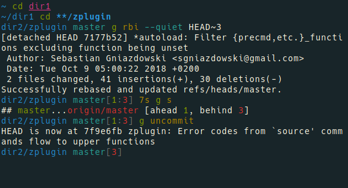

# Twodir (Fork of Pure)

> Pretty, compact, and fast ZSH prompt




## Overview

This prompt is based on [Pure by sindresorhus](https://github.com/sindresorhus/pure).

Most prompts are verbose and slow. I wanted something that fit in one line, ran asynchronously, and showed me all the information I needed.

### Why?

* Displays the current and parent directory, the full path is often too much for a single line, and the cwd is often not enough context.
- Comes with no prompt character.
- Shows `git` branch and whether it's dirty (with a `*`).
- Indicates when you have unpushed/unpulled `git` commits and how many. *(Check is done asynchronously!)*
- Command execution time will be displayed if it exceeds the set threshold.
- Username and host only displayed when in an SSH session.
- Shows the current path in the title and the current folder & command when a process is running.
- Makes an excellent starting point for your own custom prompt.

## Install

Can be installed with your favorite plugin manager. Requires Git 2.0.0+ and ZSH 5.2+. Older versions of ZSH are known to work, but they are **not** recommended.

### Manually

1. Either…
  - Clone this repo
  - add it as a submodule, or
  - just download [`pure.zsh`](pure.zsh) and [`async.zsh`](async.zsh)

2. Symlink `pure.zsh` to somewhere in [`$fpath`](https://www.refining-linux.org/archives/46-ZSH-Gem-12-Autoloading-functions.html) with the name `prompt_pure_setup`.

3. Symlink `async.zsh` in `$fpath` with the name `async`.

#### Example

```console
$ ln -s "$PWD/pure.zsh" /usr/local/share/zsh/site-functions/prompt_pure_setup
$ ln -s "$PWD/async.zsh" /usr/local/share/zsh/site-functions/async
```
*Run `echo $fpath` to see possible locations.*

For a user-specific installation (which would not require escalated privileges), simply add a directory to `$fpath` for that user:

```sh
# .zshenv or .zshrc
fpath=( "$HOME/.zfunctions" $fpath )
```

Then install the theme there:

```console
$ ln -s "$PWD/pure.zsh" "$HOME/.zfunctions/prompt_pure_setup"
$ ln -s "$PWD/async.zsh" "$HOME/.zfunctions/async"
```


## Getting started

Initialize the prompt system (if not so already) and choose `pure`:

```sh
# .zshrc
autoload -U promptinit; promptinit
prompt pure
```


## Options

| Option                           | Description                                                                                    | Default value  |
| :------------------------------- | :--------------------------------------------------------------------------------------------- | :------------- |
| **`PURE_CMD_MAX_EXEC_TIME`**     | The max execution time of a process before its run time is shown when it exits.                | `5` seconds    |
| **`PURE_GIT_PULL=0`**            | Prevents Pure from checking whether the current Git remote has been updated.                   |                |
| **`PURE_GIT_UNTRACKED_DIRTY=0`** | Do not include untracked files in dirtiness check. Mostly useful on large repos (like WebKit). |                |
| **`PURE_GIT_DELAY_DIRTY_CHECK`** | Time in seconds to delay git dirty checking when `git status` takes > 5 seconds.               | `1800` seconds |
| **`PURE_PROMPT_SYMBOL`**         | Defines the prompt symbol.                                                                     | `❯`            |
| **`PURE_PROMPT_VICMD_SYMBOL`**   | Defines the prompt symbol used when the `vicmd` keymap is active (VI-mode).                    | `❮`            |

## Example

```sh
# .zshrc

autoload -U promptinit; promptinit

# optionally define some options
PURE_CMD_MAX_EXEC_TIME=10

prompt pure
```


## Tips


To have commands colorized as seen in the screenshot, install [fast-syntax-highlighting](https://zdharma/fast-syntax-highlighting).


## Integration

### [oh-my-zsh](https://github.com/robbyrussell/oh-my-zsh)

1. Set `ZSH_THEME=""` in your `.zshrc` to disable oh-my-zsh themes.
2. Follow the Pure [Install](#install) instructions.
3. Do not enable the following (incompatible) plugins: `vi-mode`, `virtualenv`.

**NOTE:** `oh-my-zsh` overrides the prompt so Pure must be activated *after* `source $ZSH/oh-my-zsh.sh`.

<!-- TODO:
### [prezto](https://github.com/sorin-ionescu/prezto)

Pure is bundled with Prezto. No need to install it.

Add `prompt pure` to your `~/.zpreztorc`.

### [zim](https://github.com/Eriner/zim)

Pure is bundled with Zim. No need to install it.

Set `zprompt_theme='pure'` in `~/.zimrc`.
-->

### [antigen](https://github.com/zsh-users/antigen)

Update your `.zshrc` file with the following two lines (order matters). Do not use the `antigen theme` function.

```sh
antigen bundle mafredri/zsh-async
antigen bundle xPMo/twodir-zsh-theme
```

### [antibody](https://github.com/getantibody/antibody)

Update your `.zshrc` file with the following two lines (order matters):

```sh
antibody bundle mafredri/zsh-async
antibody bundle xPMo/twodir-zsh-theme
```

### [zplug](https://github.com/zplug/zplug)

Update your `.zshrc` file with the following two lines:

```sh
zplug mafredri/zsh-async, from:github
zplug xPMo/twodir-zsh-theme, use:pure.zsh, from:github, as:theme
```

### [zplugin](https://github.com/zdharma/zplugin)

Update your `.zshrc` file with the following two lines (order matters):

```sh
zplugin ice pick"async.zsh" src"pure.zsh"
zplugin light xPMo/twodir-zsh-theme,
```

## FAQ

There are currently no FAQs.

See [FAQ Archive](https://github.com/xPMo/twodir-zsh-theme/wiki/FAQ-Archive) for previous FAQs.

## Ports

- **ZSH**
	- [therealklanni/purity](https://github.com/therealklanni/purity) - More compact current working directory, important details on the main prompt line, and extra Git indicators.
 	- [intelfx/pure](https://github.com/intelfx/pure) - Solarized-friendly colors, highly verbose, and fully async Git integration.
	- [dfurnes/purer](https://github.com/dfurnes/purer) - Compact single-line prompt with built-in Vim-mode indicator.
- **Bash**
	- [sapegin/dotfiles](https://github.com/sapegin/dotfiles) - [Prompt](https://github.com/sapegin/dotfiles/blob/dd063f9c30de7d2234e8accdb5272a5cc0a3388b/includes/bash_prompt.bash) and [color theme](https://github.com/sapegin/dotfiles/tree/master/color) for Terminal.app.
- **Fish**
	- [brandonweiss/pure.fish](https://github.com/brandonweiss/pure.fish) - Pure-inspired prompt for Fish. Not intended to have feature parity.
	- [rafaelrinaldi/pure](https://github.com/rafaelrinaldi/pure) - Support for bare Fish and various framework ([Oh-My-Fish](https://github.com//oh-my-fish/oh-my-fish), [Fisherman](https://github.com//fisherman/fisherman), and [Wahoo](https://github.com//bucaran/wahoo)).
- **Rust (ZSH)**
	- [xcambar/purs](https://github.com/xcambar/purs) - Pure-inspired prompt in Rust.


## Team

[](http://sindresorhus.com) | [](https://github.com/mafredri)
---|---
[Sindre Sorhus](https://github.com/sindresorhus) | [Mathias Fredriksson](https://github.com/mafredri)


## License

MIT © [Sindre Sorhus](https://sindresorhus.com)
